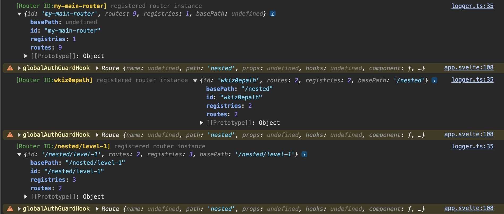

# Debugging

There are a few way to debug things.

## Debug Logger

In your `vite.config.ts` file, you can add the following:

```ts
export default defineConfig({
  plugins: [svelte()],
  build: {
    sourcemap: true // If you want to use a debugger, add this!
  },
  define: {
    // Tell the router to log when we're in debug mode.
    // Otherwise, this statement is removed by the compiler (known as tree-shaking)
    // and all subsequent log statements are removed at build time:
    'import.meta.env.SPA_ROUTER': {
      logLevel: "debug"
    },
  }
});
```

This allows us to log when we're in debug mode otherwise
statements like this are removed by the compiler (known astree-shaking):

```ts
if (import.meta.env.SPA_ROUTER && import.meta.env.SPA_ROUTER.logLevel === "debug") {
  log.debug(this.config.id, "unregistered router instance", {
    id: this.config.id,
    routes: this.routes.size
  });
}
```

Putting it all together:

```svelte
<script lang="ts">
  import { Router, type RouterInstance } from "@mateothegreat/svelte5-router";

  let instance: RouterInstance;

  if (import.meta.env.SPA_ROUTER && import.meta.env.SPA_ROUTER.logLevel === "debug") {
    log.debug(instance.id, "dumping routes", {
      config: instance.config,
      routes: instance.routes,
      current: instance.current,
      navigating: instance.navigating
    });
  }
</script>

<Router bind:instance {routes}>
```

Example output:


