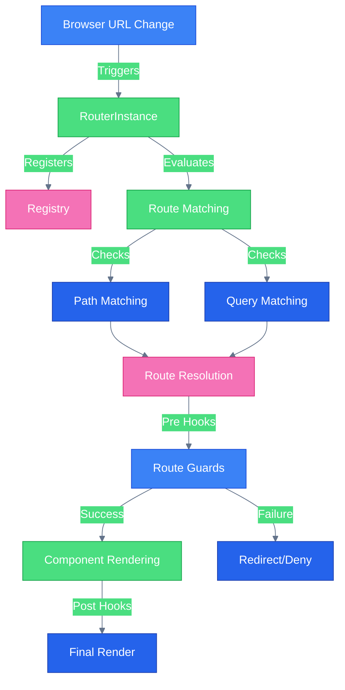
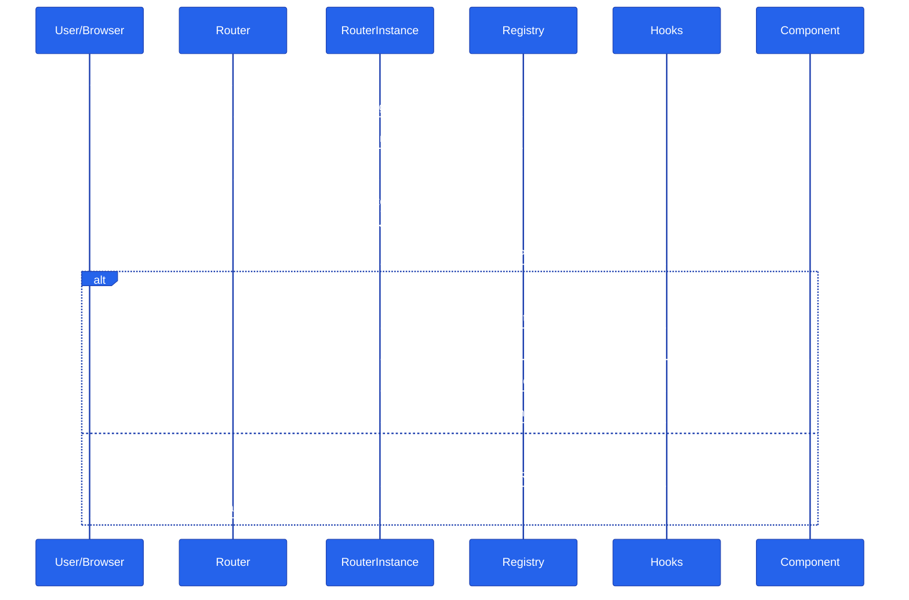
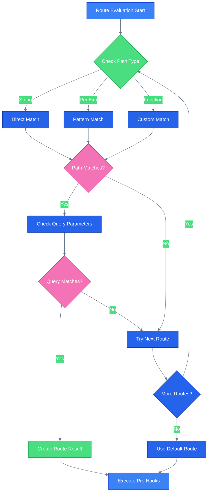
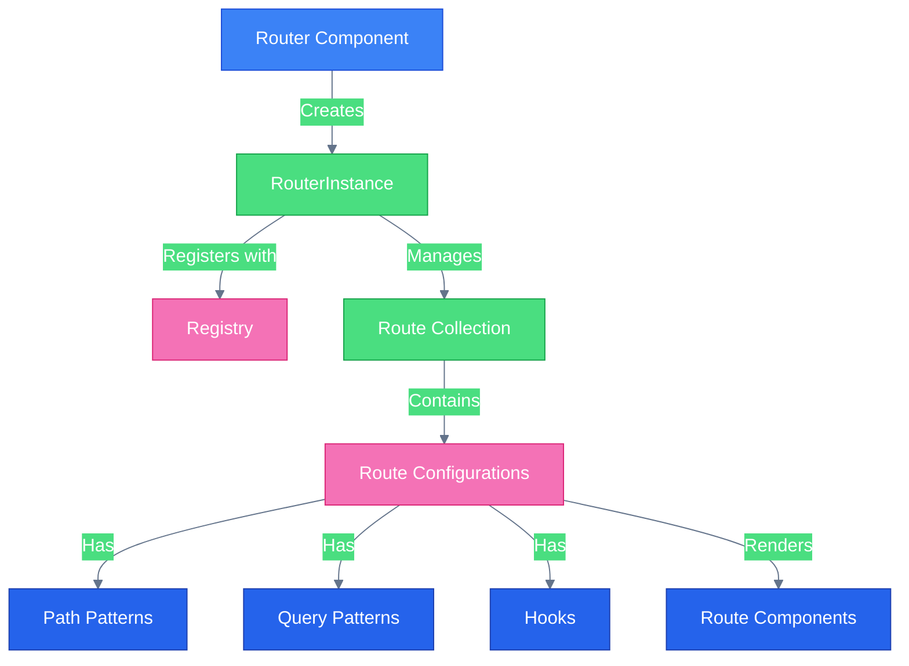

# Router Architecture Diagrams

This document contains Mermaid diagrams that illustrate the architecture and flow of the Svelte 5 Router. These diagrams are designed to help you understand how the router works internally.

## 1. Router Architecture

Shows the high-level architecture of the router, including how URL changes flow through the system to component rendering.

## 2. Routing Lifecycle

A sequence diagram showing the temporal flow of routing operations from URL change to final render.

## 3. Route Evaluation

A detailed flowchart showing how routes are evaluated, including path matching, query parameter checking, and hook execution.

## 4. Component Hierarchy

Shows the relationship between different components in the router system.

