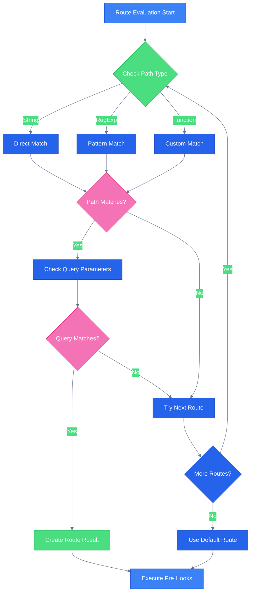

# Svelte 5 SPA Router 🚀 🔥


An SPA router for Svelte that allows you to divide & conquer your app with nested routers, snippets, and more.

> [!NOTE]
> Live demo: <https://demo.router.svelte.spa>
>
> API documentation: <https://docs.router.svelte.spa>

## Features

- Built for Svelte 5 🚀!
- Divide & conquer - use nested routers all over the place.
- Use components, snippets, or both 🔥!
- Use regex paths (e.g. `/foo/(.*?)/bar`) and/or named parameters together.
- Use async routes simply with `component: async () => import("./my-component.svelte")`.
- Add hooks to your routes to control the navigation flow 🔧.
- Automagic styling of your anchor tags 💄.
- Helper methods 🛠️ to make your life easier.
- Debugging tools included 🔍.

## Installation

```bash
npm install @mateothegreat/svelte5-router
```

## Table of Contents

- [Getting Started](https://github.com/mateothegreat/svelte5-router/blob/main/docs/getting-started.md)
- [Routing](https://github.com/mateothegreat/svelte5-router/blob/main/docs/routing.md)
- [Hooks](https://github.com/mateothegreat/svelte5-router/blob/main/docs/hooks.md)
- [Actions](https://github.com/mateothegreat/svelte5-router/blob/main/docs/actions.md)
- [Helper Methods](https://github.com/mateothegreat/svelte5-router/blob/main/docs/helpers.md)
- [Default Status Mapping](https://github.com/mateothegreat/svelte5-router/blob/main/docs/statuses.md)
- [The Router Registry](https://github.com/mateothegreat/svelte5-router/blob/main/docs/registry.md)
- [Route Styling](https://github.com/mateothegreat/svelte5-router/blob/main/docs/styling.md)
- [Accessing Props](https://github.com/mateothegreat/svelte5-router/blob/main/docs/props.md)
- [Debugging](https://github.com/mateothegreat/svelte5-router/blob/main/docs/debugging.md)

## How it works

When the browser URL changes, the router instance is triggered. It then registers the route in the registry, evaluates the route matching, and resolves the route.

<div align="center">



</div>

> [!NOTE]
> You can view more diagrams in [diagrams.md](./docs/diagrams.md).
