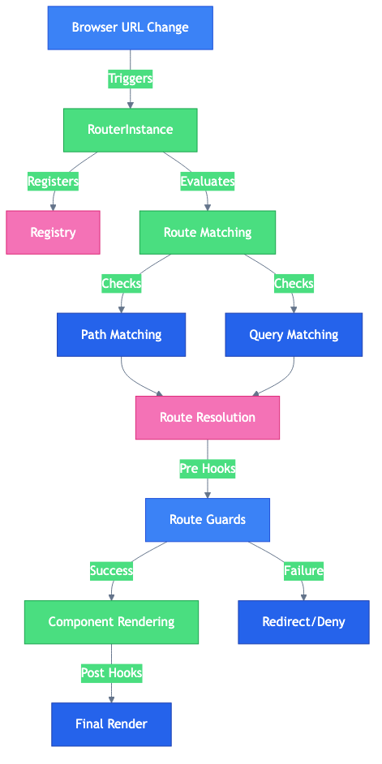

# Svelte 5 SPA Router 🚀 🔥


An SPA router for Svelte that allows you to divide & conquer your app with nested routers, snippets, and more.

> [!NOTE]
> Live demo: <https://demo.router.svelte.spa>
>
> API documentation: <https://docs.router.svelte.spa>

## Features

- Built for Svelte 5 🚀!
- Divide & conquer - use nested routers all over the place.
- Use components, snippets, or both 🔥!
- Use regex paths (e.g. `/foo/(.*?)/bar`) and/or named parameters together.
- Use async routes simply with `component: async () => import("./my-component.svelte")`.
- Add hooks to your routes to control the navigation flow 🔧.
- Automagic styling of your anchor tags 💄.
- Helper methods 🛠️ to make your life easier.
- Debugging tools included 🔍.

## Latest News

### July 1, 2025

Version 2.15.4 released! 🎉 with some healthy updates!

- 🔧 Added support for passing your own props down to the routed component ([#70](https://github.com/mateothegreat/svelte5-router/issues/70) - thanks [@inZaCz](https://github.com/inZaCz)).
- 🐛 Fixed a bug where the router would not re-render the same component when the route changes.
- 📊 Added [Router Architecture Diagrams](./diagrams.md) to give you a better understanding of how the router works.
- 🎉 New demos for more patterns and use cases at <https://demo.router.svelte.spa/patterns>.

> [!NOTE]
> I'd like to share what svelte5-router is doing in the wild! If you're using it, please share your project with me by sending me a message on discord at [@mateothegreat](https://discord.com/users/505520869246763009) or just create a [new issue](https://github.com/mateothegreat/svelte5-router/issues/new) and I'll add it to the list. 🙏

## Installation

```bash
npm install @mateothegreat/svelte5-router
```

Now you can simply:

```svelte
<a href="/dashboard" use:route>Dashboard</a>
```

By adding `use:route` you will prevent the page from reloading and instead let the router take the wheel 🤸. Peruse the rest of the documentation at [docs/](docs/) for more details.

> [!NOTE]
> Without `use:route` the website will be reloaded after opening a new route. To prevent this use `goto()` or `use:route` so only the Route element get's changed.

and `/ship-it`!

> See [actions.md#route](actions.md#route) for the deets..

## Table of Contents

- [Getting Started](./getting-started.md)
- [Routing](./routing.md)
- [Hooks](./hooks.md)
- [Actions](./actions.md)
- [Helper Methods](./helpers.md)
- [Default Status Mapping](./statuses.md)
- [The Router Registry](./registry.md)
- [Route Styling](./styling.md)
- [Accessing Props](./props.md)
- [Debugging](./debugging.md)
- [Diagrams](./diagrams.md)

> [!NOTE]
> Include [llms.txt](../llms.txt) in your LLM prompt to get add rich context to your tasks by referencing `https://raw.githubusercontent.com/mateothegreat/svelte5-router/refs/heads/main/llms.txt`.

## How it works

When the browser URL changes, the router instance is triggered. It then registers the route in the registry, evaluates the route matching, and resolves the route.

<div align="center">
  
</div>

> [!NOTE]
> You can view more diagrams in [diagrams.md](./diagrams.md).
