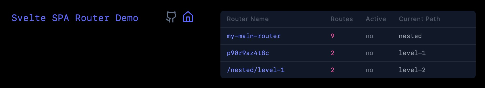

# Router Registry

The router [registry](../src/lib/registry.svelte.ts) is a global object that is used to store route
instances and their associated routing configuration.

This registry updates as you navigate through your application and as `<Router />` components
are mounted and unmounted dynamically.



## Usage

Though the registry is managed internally, though you can access it to debug your application.

When `<Router />` is mounted, it will register itself in the registry.

When `<Router />` is unmounted, it will unregister itself from the registry.

You can access the __global__ registry to debug your application by adding the following to your application:

```svelte
<script lang="ts">
  import { registry } from "@mateothegreat/svelte5-router";
</script>

<div>
  {#each registry.instances.entries() as [id, instance]}
    <div>
      <pre>id: {id}</pre>
      <pre>routes: {instance.routes.size}</pre>
      <pre>current: {instance.current?.path || "<default>"}</pre>
      <pre>navigating: {instance.navigating ? "yes" : "no"}</pre>
    </div>
  {/each}
</div>
```

Or, you can access the __local__ registry directly from your `<Router />` component:

```svelte
<script lang="ts">
  import type { RouterInstance } from "@mateothegreat/svelte5-router";
  import { Router } from "@mateothegreat/svelte5-router";

  let instance = $state<RouterInstance>();

  $inspect(instance); // Outputs the registry instance to the console.
</script>

<Router bind:instance {routes} />
```
